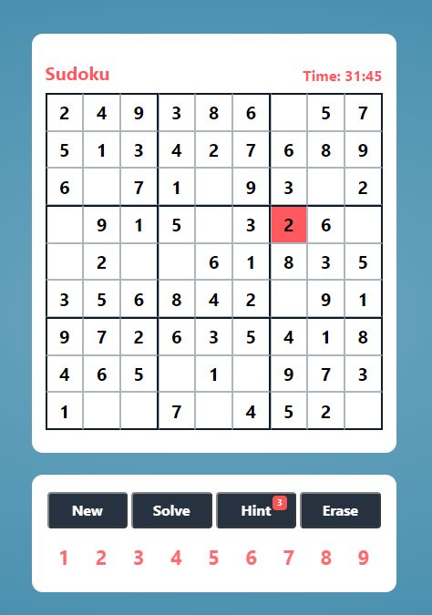

# Sudoku 

## Description 
- React app that serves react-redux commands on a simple webpage. 
- Visit here: https://sudoku-react-ca.herokuapp.com/

## Functionality 
- Buttons:
    - New: Create new game.
    - Solve: Generate solution to current game.
    - Hint: Get next solution to board cell in increasing row and column order.
    - Erase: Delete Input value of currently selected cell.
    - Number Pad: Inputing values in currently selected cell.

## New Features:
- Use of arrow keys to move focused cell 
    - Can use number pad to input values and delete value via backspace key 

## References 
- Hosted on [Heroku](https://www.heroku.com/)
- Uses [react-hook-mousetrap](https://github.com/olup/react-hook-mousetrap) API for keyboard actions

